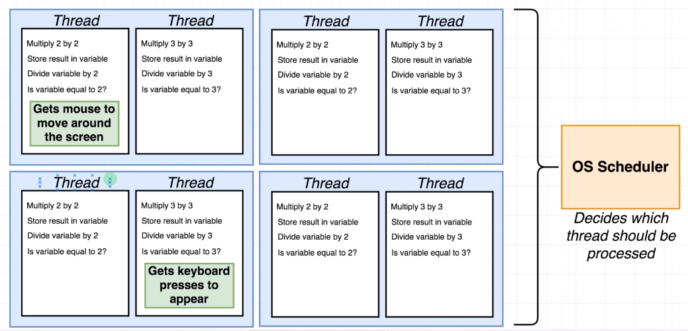
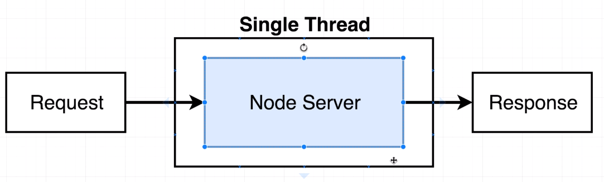
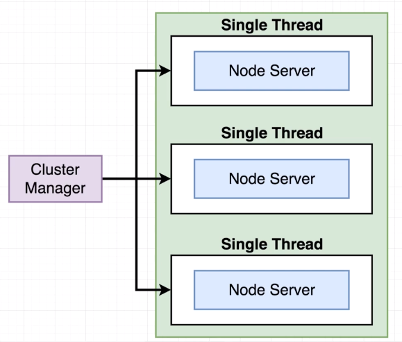

# Advanced Node for Developers

Diagrams: <https://www.diagrams.net/>

## 1 - Internals

### 1.1 - Node Internals


### 1.2 - Implementations


### 1.3 - C++


### 1.4 - Threads





### 1.5 - Event Loop


```javascript
// node myFile.js

const pendingTimers = []
const pendingOSTasks = []
const pendingOperations = []

// new timers, tasks, operations are recorded from myFile running
myFile.runContents()

const shouldContinue = () => {
  /*
  #1: Any pending setTimeout, setInterval, setImmediate

  #2: Any pendingOSTasks (e.g server listening to port)

  #3: Any pendingOperations (e.g fs module)
  **/
  return (
    pendingTimers.length || pendingOSTasks.length || pendingOperations.length
  )
}

// Entire body executes in one TICK
while (shouldContinue()) {
  /*
  #1 Node checks pendingTimers and if there are any functions ready to be called - callbacks

  #2 Node checks pendingOSTasks and if there are any functions ready to be called - callbacks

  #3 Node checks pendingOperations and if there are any functions ready to be called - callbacks

  #4 Pause execution. continue when:
  - timer is about to complete
  - pendingOSTask is done
  - pendingOperation is done

  #5 Look at pendingTimers. Call any setImmediate

  #6 Handle any 'close' events eg readStream.on('close' => {...})

  **/
}
```

### 1.6 - Single-Threaded?


```javascript
import { performance } from 'perf_hooks'
import crypto from 'crypto'

const start = performance.now()
crypto.pbkdf2('a', 'b', 100000, 512, 'sha512', () => {
  console.log('1: ', performance.now() - start)
  // 917.1989880055189
})

crypto.pbkdf2('a', 'b', 100000, 512, 'sha512', () => {
  console.log('2: ', performance.now() - start)
  // 945.7754510045052
})
```

### 1.7 - Libuv Thread Pool

#### Default: 4 threads


### 1.8 - Threadpools with Multithreading


```javascript
import { performance } from 'perf_hooks'
import crypto from 'crypto'

const start = performance.now()
crypto.pbkdf2('a', 'b', 100000, 512, 'sha512', () => {
  console.log('1: ', performance.now() - start)
  // 893.1103910058737
})

crypto.pbkdf2('a', 'b', 100000, 512, 'sha512', () => {
  console.log('2: ', performance.now() - start)
  // 869.9508370012045
})

crypto.pbkdf2('a', 'b', 100000, 512, 'sha512', () => {
  console.log('3: ', performance.now() - start)
  // 915.4592999964952
})

crypto.pbkdf2('a', 'b', 100000, 512, 'sha512', () => {
  console.log('4: ', performance.now() - start)
  // 945.7754510045052
})

crypto.pbkdf2('a', 'b', 100000, 512, 'sha512', () => {
  console.log('5: ', performance.now() - start)
  // 1597.9073330014944
})
```

### 1.9 - Changing Threadpool size


```javascript
// Default: 4 threads
process.env.UV_THREADPOOL_SIZE = 2
```


### 1.10 - OS Operations


```javascript
import https from 'https'
import { performance } from 'perf_hooks'

const init = performance.now()

const doRequest = () =>
  https
    .request('https://www.google.com', (res) => {
      res.on('data', () => {})
      res.on('end', () => {
        console.log(performance.now() - init)
      })
    })
    .end()

doRequest() // 385.8212580084801
doRequest() // 386.08700999617577
doRequest() // 387.06043699383736
doRequest() // 387.2905650138855
doRequest() // 387.4232259988785
```


### 1.11 - Event Loop Review

#### Tick: one execution of the event loop


### 1.12 - Unexpeted Event Loop Behavior

```javascript
import { performance } from 'perf_hooks'
import crypto from 'crypto'
import https from 'https'
import fs from 'fs'
import path from 'path'

const start = performance.now()
const BASE_DIR = path.resolve()

const doHash = (id) =>
  crypto.pbkdf2('a', 'b', 100000, 512, 'sha512', () => {
    console.log(`${id}: `, performance.now() - start)
  })

const doRequest = () =>
  https
    .request('https://www.google.com', (res) => {
      res.on('data', () => {})
      res.on('end', () => {
        console.log(performance.now() - start)
      })
    })
    .end()

doRequest()

console.log(path.resolve())
fs.readFile(path.join(BASE_DIR, 'sandbox.js'), 'utf8', () => {
  console.log('FS:', performance.now() - start)
})

doHash(1)
doHash(2)
doHash(3)
doHash(4)

/*
Request:    259.59928500652313 
Hash 2:     693.1666750013828 
FS:         694.0922180116177 
Hash 1:     707.5694110095501 
Hash 3:     761.2291159927845 
Hash 4:     775.8082939982414 
**/
```

#### If threadpool size is increased to 5

```javascript
process.env.UV_THREADPOOL_SIZE = 5
/*
FS:         94.0922180116177 
Request:    259.59928500652313 
Hash 2:     693.1666750013828 
Hash 1:     707.5694110095501 
Hash 3:     761.2291159927845 
Hash 4:     775.8082939982414 
**/
```


## 2 - Enhance Node Performance

### 2.1 Clustering

#### Normal app




#### Clustered app




### 2.2 Benchmarking Server Performance

```bash
ab -c 50 -n 500 localhost:3000/fast
```

### 2.3 Forking


### 2.4 PM2

#### <https://pm2.io/>

```bash
npm i -G pm2

# -i 0 => let PM2 decide the amount of logical cores
# logical core = physical core * amount of simultaneous threads
pm2 start index.js -i 0
```

#### Common commmands

```bash
pm2 list

pm2 show <name>

pm2 monit

pm2 delete <name>
```

### 2.5 Webworker Threads


