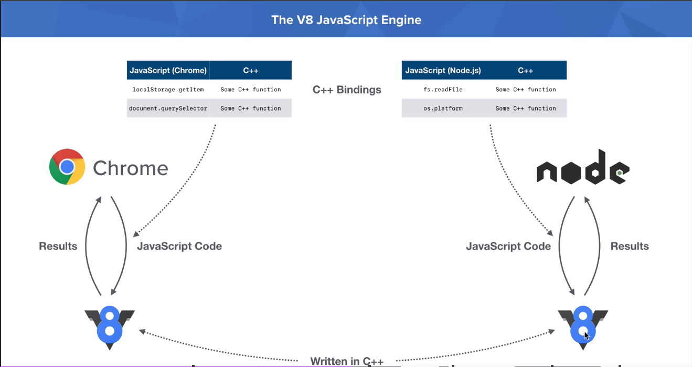
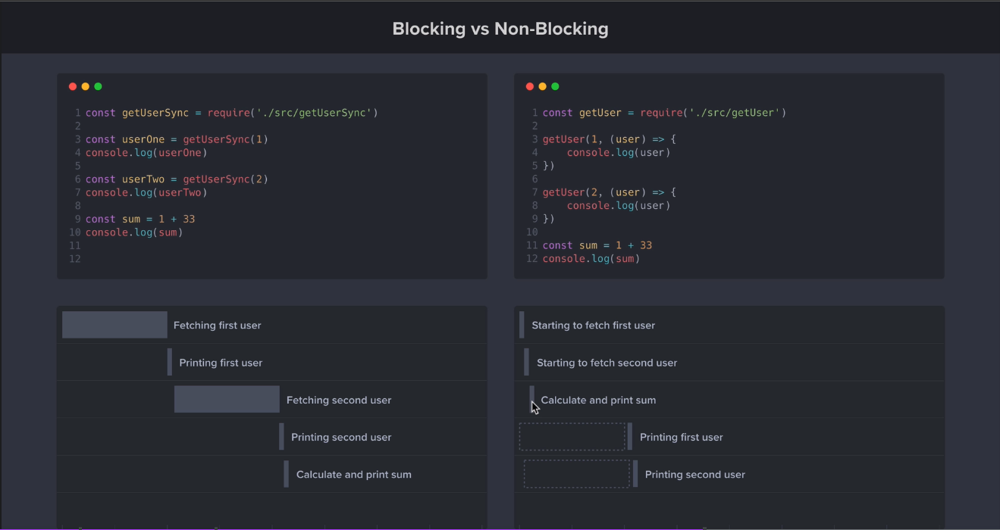

# Complete Node.js Developer Course

## What is Node.js

### Javascript Runtime built on top of Chrome's V8 Javascript engine

#### V8 Engine

- Created/maintained by createdGoogle
- Written in C++
- Chrome and Node.js do not compile JS.
  - They send code to V8 whose one responsibility is compile and evaluate JS code.
  - V8 however does not know what is a `window`, `document` or `process` keywords.
  - Chrome and Node.js provide C++ bindings to V8 extending its core functionality.

| Chrome         | Node    |
| -------------- | ------- |
| window         | global  |
| document (DOM) | process |



### Non-blocking I/O

#### Node keeps running background tasks while I/O operations occurr



### Event Driven

#### Process of registering callbacks and have then called when the operation is done

## Node.js Module System

```javascript
const fs = require('fs') // or import fs from 'fs' - FileSystem

const fileName = 'whatever.txt'
const str1 = 'foo'
const str2 = 'bar'

fs.writeFileSync(fileName, str1)
fs.appendFileSync(fileName, str1)
const dataBuffer = fs.readFileSync(fileName)
console.log(dataBuffer.toString())
```

### Require x Import

```javascript
// source
const x = 'X'
module.exports = x

// destination
const x = require('source')

// OR
// source
export const x = 'X'

// destination
import x from 'source'
```

### NPM packages

- `validator` - validates strings
- `chalk` - colorize prints (`winston`)
- `nodemon` - restart on code changes

## File System and Command Line Args

### bare hand

```bash
node app.js foo --title=bar
```

```javascript
// app.js
// captured by the `process` keyword
console.log(process.argv)
// output [node path, app.js path, ´foo´, ´--title=bar´]
```

### yargs

```bash
npm i yargs
node app.js foo --title=bar
```

```javascript
// app.js
console.log(yargs.argv)
// output {_: ['foo'], title: 'bar', '$0': 'app.js'}
```

#### Configuring CLI multiple commands

```javascript
// app.js
// Customize yargs version
yargs.version('1.1.0')

// Create add command
yargs.command({
  command: 'add',
  describe: 'Add a new note',
  builder: {
    title: {
      describe: 'Note title',
      demandOption: true,
      type: 'string',
    },
    body: {
      describe: 'Note body',
      demandOption: true,
      type: 'string',
    },
  },
  handler: function (argv) {
    console.log('Title: ' + argv.title)
    console.log('Body: ' + argv.body)
  },
})

// Create remove command
yargs.command({
  command: 'remove',
  describe: 'Remove a note',
  handler: function () {
    console.log('Removing the note')
  },
})

yargs.parse()
```

### JSON

#### JSON.stringify

```javascript
const book = {
  title: 'Foo',
  author: 'Bar',
}

const bookStringified = JSON.stringify(book)
// {"title": "Foo", "author": "Bar"}
```

#### JSON.parse

```javascript
const bookStringified = '{"title": "Foo", "author": "Bar"}'

const book = JSON.parse(bookStringified)
/**
{
  title: 'Foo',
  author: 'Bar',
}
*/
```

### Arrow functions and this bindings

```javascript
const event = {
  name: 'bday bash',
  // guestList = () => this.name will NOT work once arrow functions does not bind their own this value and instead capture from the first outer context
  guestList() {
    console.log(`Guest list for ${this.name}`)
  },
}

// However
const event = {
  name: 'bday bash',
  guests: ['John', 'Bruce', 'Mathew'],
  guestList() {
    console.log(`Guest list for ${this.name}`)
    guests.forEach((guest) => {
      console.log(`${guest} invited to ${this.name}!`)
    })
  },
}
```
