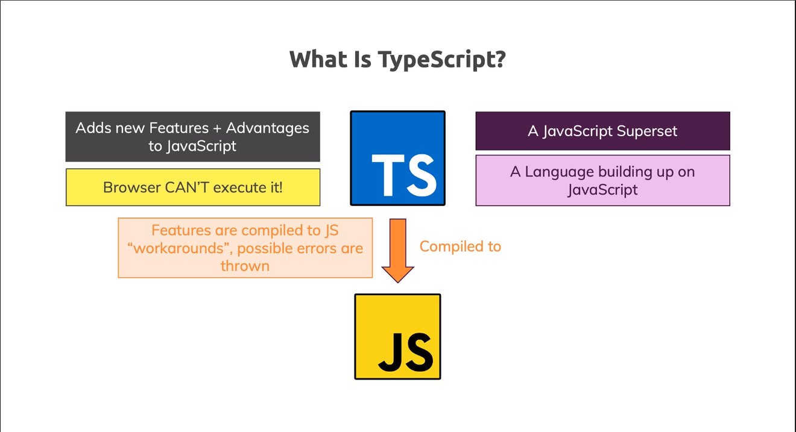
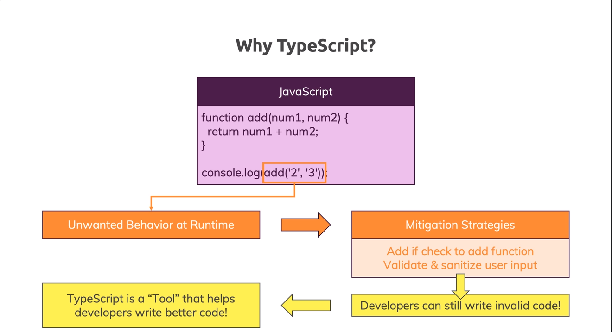
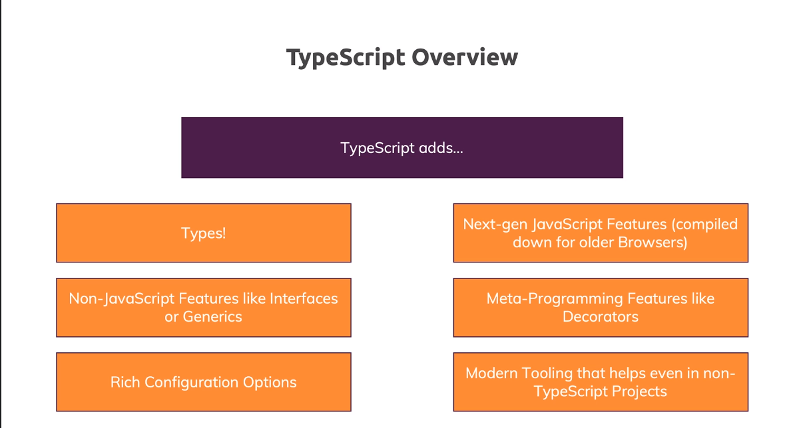
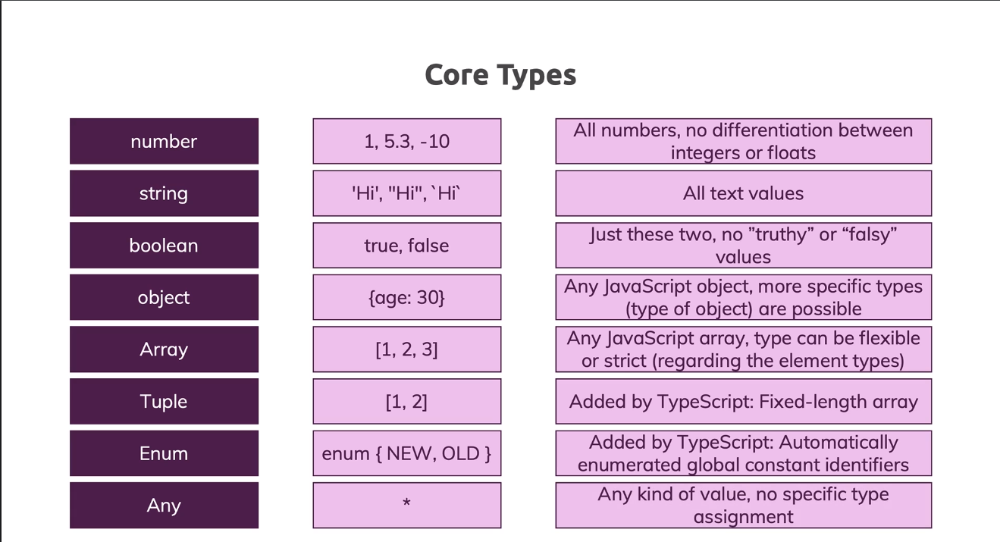

# Understanding Typescript

## 1 - Getting Started





```bash
sudo npm i -g typescript

tsc -v

tsc <path/to/file>
```

## 2 - TypeScript Basics & Basic Types

### Typescript Basic Types



- `number`: no float or integer
- `string`
- `boolean`
- `object`
- `Array` or `[]`
- `Tuple`: fixed length and type
- `Enum`
- `Any`
- `unkown`: more restrictive than `any`, which "disables" checking completely
  - better choice over `any`
  - should required a subsequente type checking on runtime
- `never`: close to `void` behavior
  - when raising errors it will never returns anything
