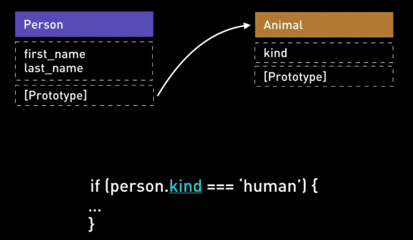
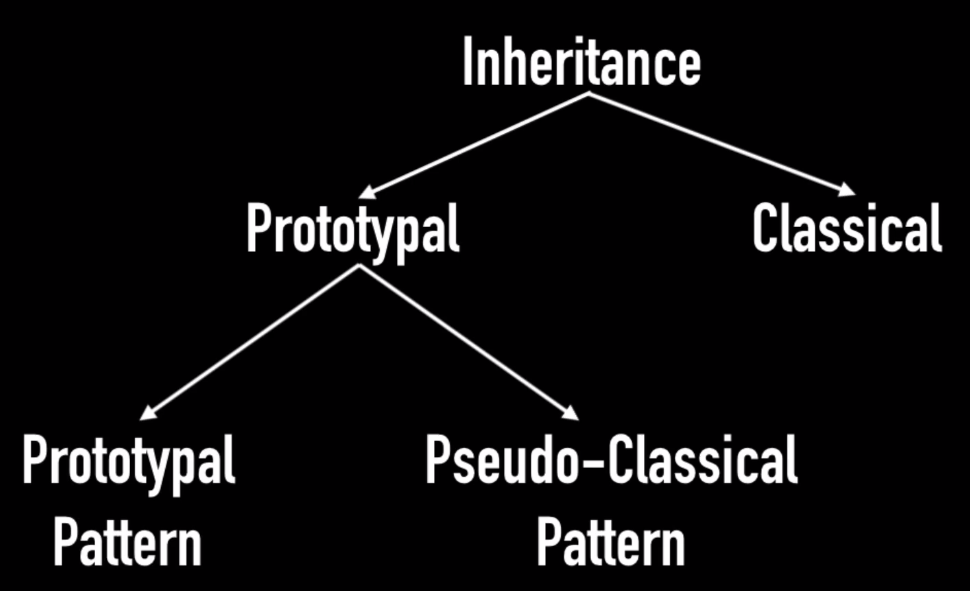
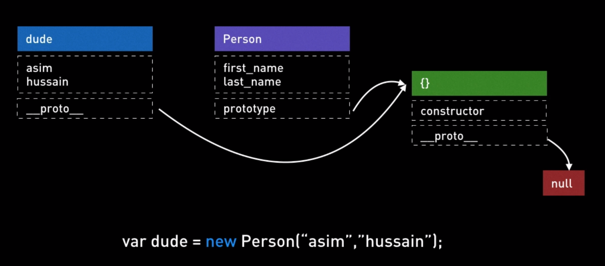
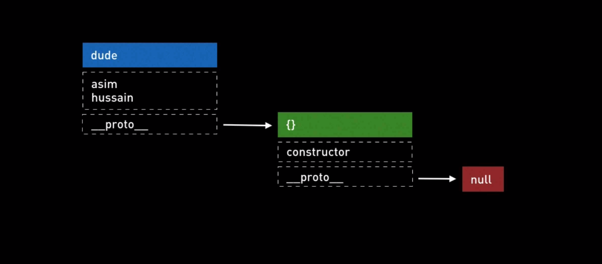
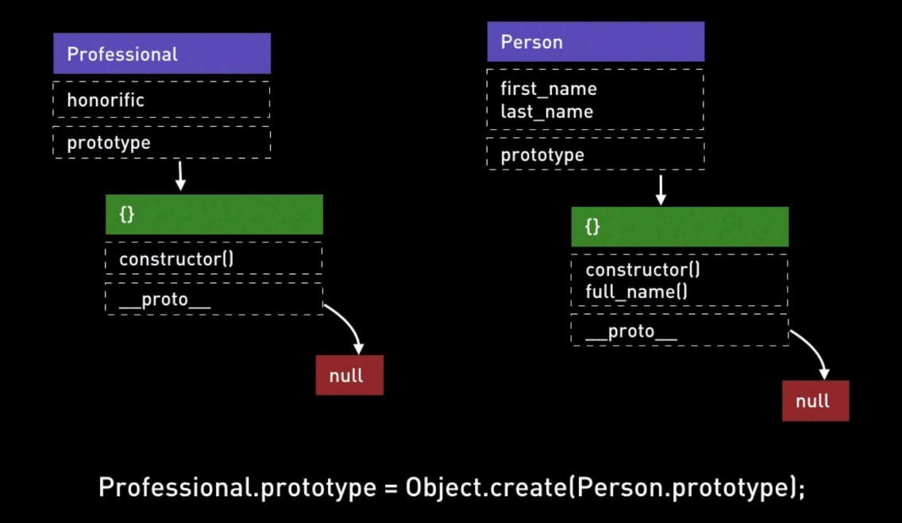
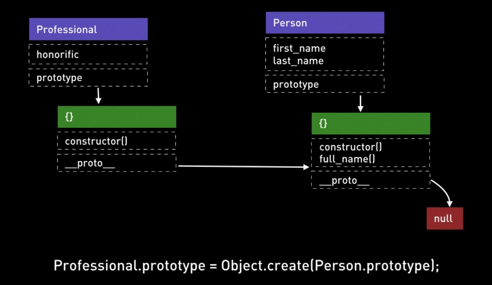
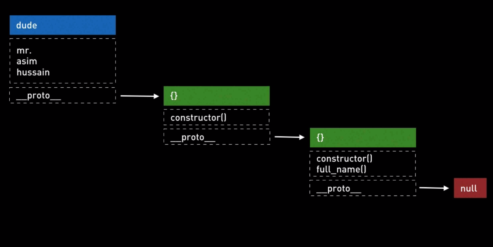

# Javascript Advanced

## Basics

### TC39

<https://tc39.es/>

- No company creating JS
- JS is an agreement of TC39 a committee
- 100% backwards compatible by design

### Compilations vs Polyfilling

#### Compilation (Babel)

- Allows to write modern JS and compiles the code down to a version of the language to make it understandable for instance in old versions of browsers

#### Polyfill

- Is a piece of code (usually JavaScript on the Web) used to provide modern functionality on older browsers that do not natively support it.
- Re-writes modern features using old style JS, adding new functionality to old V8 Engines

### "use strict"

- Strict mode allows to place a program or a function in a strict operating context
- Makes debugging easier
  - Code errors that would otherwise have been ignored or would have failed silently will generate errors or throw exceptions and directs you quickly to the probable source
- forbid JS keyword uses
- cannot delete functions, numbers, function args
- Variables defined within the `eval()` context will not the spilled to the outter context

### Passing args by Value or Reference

#### Primitive types

- Strings, numbers, booleans: `value`

#### Objects

- `reference`

### Rest operators

Legacy:

```javascript
const sum = (a, b) => {
  console.log(arguments)
  return a + b
}

sum(1, 2, 3, 4)
// [1,2,3,4]
// return 3
```

- `[one, two, ...rest]`

### Spread operator

- `[...spread]` or `{...spread}`

### Template Strings

```javascript
const s = `hey hey ${you}`

// styled components (react)
const tag = (str) => str

const sc = tag`<h1>${you}</h1>`
```

## Types and Equality

### Types

- `boolean`: true/false
- `number`: 1/1.111
- `NaN`: number
- `string`: 'a'
- `null`: null
- `undefined`: undefined
- `object`: new Object()

- `undefined`: variable initialized with no value or no variable
- `null`: explicit return or value from a variable/function

### Equality

- `==` checks value equality - type coersion
- `===` checks value and type equality - strict equality operator

### NaN

```javascript
// NaN compared to anything is falses
NaN == NaN // false!
NaN === NaN // false!

// to check a variable is NaN then:
const x = NaN
x === x // if false, then it's NaN
```

## Scopes & Variable

### global variables

| Chrome | Nodejs |
| ------ | ------ |
| window | global |

### blocked-scoped variables

```javascript
{
  var a = 'block'
  let b = 'inside'
  const c = 'also'
}
console.log(a) // block
console.log(b) // ReferenceError: b is not defined
console.log(c) // ReferenceError: c is not defined
```

### hoisting

- put variable and function declarations in the top of the scope/script/function
- leave variable assignments to the same line they were originally set

```javascript
'use sctrict'

console.log(a)
var a = 1

// output: undefined
```

### scope chain

- lexically by order of declaration

```javascript
{
  var myVar = 1
  {
    {
      {
        {
          console.log(myVar) // 1
        }
      }
    }
  }
}
```

### IIFE - Immediatly Invoked Function Expression

- overwrite variables and functions whose name are the same while being invoked
  - **if and only if** the overwrite occurs in the same scope!
- turnaround: wrapping an anonymous function and calling that (inner scope is never exposed):

```javascript
;(() => {
  var thing = 'whatever'
  console.log('other: ', thing)
})()
```

### closures

- wrapping/encapsulating an inner function in an outter one

```javascript
const f = (name) => {
  var text = `Hello ${name}`
  return () => {
    console.log(text)
  }
}
```

- caveat

```javascript
var foo = []
for (var i = 0; i < 10; i++) {
  foo[i] = function () {
    return i
  }
}

console.log(foo[0]) // 10
console.log(foo[1]) // 10
console.log(foo[2]) // 10
```

## Destructuring & Looping

### destructuring

```javascript
const obj = { a: 1, b: 2, c: 3 }
const { a: something, c: else } = obj

console.log(something) // 1
console.log(else) // 3

const arr = [1,2,3,4,5]

const [first, second] = arr
console.log(first) // 1
console.log(second) // 2
```

### for

```javascript
let arr = [1, 2, 3]

for (let i; i < arr.length; i++) {
  console.log(arr[i])
  // continue
  // break
  // return
}

arr.forEach((el) => {
  console.log(el)
  // no break or continue
  // return has no effect
})

for (let idx in arr) {
  console.log(arr[idx]) // '0', ´1', '2'
}

for (let number of arr) {
  console.log(number) // 1, 2, 3
}
```

## This

- determined by the calling context

```javascript
console.log(this) // this = window object

var obj = {
  checkThis() {
    console.log(this) // this = obj
  },
  checkThisOuter = () => {console.log(this)} // this = window
}
```

### call, bind, apply

- functions are objects
- `call` can stabilize the value of `this` by calling the function explicitly with the `this` argument

```javascript
const x = (param1, param2) => console.log(this)

x.foo = bar

x.toString() // (param1, param2) => console.log(this)

x() // output undefined
// or
x.call() // output undefined
// but
x.call({}) // output {}
x.call(1) // output 1
```

- `call` and `apply` will stabilize `this`
- `apply` when the function accepts a variable number of parameters

```javascript
function a(b, c, d) {
  console.log(this)
  console.log(b)
  console.log(c)
  console.log(d)
}

a.call(1, 2, 3, 4) // output: this = 1, b = 2, c = 3, d = 4
// or
a.apply(1, [2, 3, 4]) // output: this = 1, b = 2, c = 3, d = 4
```

- `bind` locks the value of `this`

```javascript
var a = function () {
  console.log(this)
}.bind(1)

var foo = { func: a }

foo.func() // 1
```

### fat arrow function

- first class functions: can be passed as an arg to another function
- syntatic sugar
- single returns allows removal of `return`
- `this`: bind the `this` from the first outter context where the function was defined

## Object Orientation

### Prototype

- All objects have a prototype



```javascript
var animal = {
  kind: 'human',
}

var foo = {}
foo.__proto__ = animal
// or
var bar = Object.create(animal, { food: { value: 'mango' } })

console.log(bar) // {animal, food: 'mango'}

console.log(foo.kind) // animal
console.log(foo.isPrototypeOf(foo)) // true

foo.kind = 'igloo'
console.log(foo.kind) // igloo
console.log(animal.kind) // human
```

### Difference between classical and prototypal inheritance



- Classical: structure architecture, a recipe
- Prototypal: an object is instantiated from another instantiated object

### Pseudo-Classical Pattern

#### Constructor OO Pattern




```javascript
'use strict'

function Person(firstName, lastName) {
  this.firstName = firstName
  this.lastName = lastName
  this.fullName = function () {
    return this.firstName + ' ' + this.lastName
  }
}

// adding methods to the Person prototype or 'pseudo class'
Person.prototype.invertName = function () {
  return `${this.lastName}, ${this.firstName}`
}

var a = Person('Foo', 'Bar') // throws error on this

var b = new Person('Foo', 'Bar') // runs smoothly
// or
var c = {}
Person.call(c, 'Foo', 'Bar')
c.fullName() // Foo Bar
c.invertName() // Bar, Foo
```

### Inheritance





```javascript
'use strict'

function Person(firstName, lastName) {
  this.firstName = firstName
  this.lastName = lastName
}

Person.prototype.invertName = function () {
  return `${this.lastName}, ${this.firstName}`
}

function Professional(honorific, firstName, lastName) {
  Person.call(this, firstName, lastName) // super, but not implemented inheritance only the constructor
  this.honorific = honorific
}

Professional.prototype = Object.create(Person.prototype) // pseudo inheritance

var prof = new Professional('Dr', 'Hey', 'Ya')
console.log(prof.invertName)
```

### Prototype OO pattern

```javascript
'use strict'
var Person = {
  init: function (firstName, lastName) {
    this.firstName = firstName
    this.lastName = lastName
    return this
  },
  fullName: function () {
    return `${this.firstName} ${this.lastName}`
  },
}

var foo = Object.create(Person)
console.log(foo)
```

## Asynchronous Programming

### Callback

- A `function X` that is passed into another `function Y` that then calls `function X`
- Callbacks are per se not async
- Can be async by setTimeout, etc, segregating the execution of the code for a Web API in Chrome or Node V8 extended

```javascript
function doAsyncTask(cb) {
  cb()
}

doAsyncTask(() => console.log(message))

let message = 'Callback Called'

// in this case, cb is sync then message does not exist in the scope

function doAsyncTask(cb) {
  setTimeout(cb, 0)
}

doAsyncTask(() => console.log(message))

let message = 'Callback Called'

// in this case, the callback function is sent to the webapi then sent to task queue
// the event loop will dequeue the callback from the task queue and push back to the call stack
```

- first parameter returned from the callback is standardized to be the `error`
  - this way the callbacks can have error handled, and a simple way to standardize is to always return the error in as the first param

```javascript
doAsyncTask((err, result) => {
  if (err) throw Error(err)
  console.log(result)
})
```

### Promises

- placeholder for a result that will be delivered in a future moment
- always async

```javascript
function doAsyncTask() {
  const promise = new Promise((resolve, reject) => {
    console.log('Async done')
    if (true) {
      resolve('Task Complete')
    } else {
      reject('boo')
    }
  })
  return promise
}

doAsyncTask()
  .then((val) => console.log(val))
  .catch((err) => console.log(err))
```

- Creating promises already resolved or rejected

```javascript
const promise = Promise.resolve('done') // promise already resolved
promise.then((val) => console.log(val)) // done
```

### Chaining promises

- forking: calling the resolved promise multiple times getting the same result

```javascript
const promise = Promise.resolve('done') // promise already resolved
promise.then((val) => console.log(val)) // done
promise.then((val) => console.log(val)) // done
```

- chaining: the result of one promise is the chained to the next one

```javascript
Promise.resolve('done')
  .then((val) => {
    console.log(val)
    return new Promise((resolve) => {
      setTimeout(() => resolve('done2'), 1000)
    })
  })
  .then((val) => console.log(val))
  .finally(() => console.log('no matter what I will be called'))
```

### Promise.all

- trigger an array of promisese and wait for all to return

```javascript
const doAsyncTask = (delay) =>
  new Promise((resolve) => setTimeout(() => resolve(delay), delay))

const promises = [doAsyncTask(1000), doAsyncTask(500), doAsyncTask(2000)]
Promise.all(promises).then((vals) => console.log(vals))
```

### Async/Await

- Easier to reason about instead of Promises
- Comes with a little expense on performance
  - `Promise.all` executes all in a non-blocking fashion
  - async/await turns non-blocking into blocking

```javascript
const doAsyncTask = () => Promise.resolve('done')
doAsyncTask().then((val) => console.log(val))
console.log('here')

// here
// done

// via async/await
const doAsyncTask = () => Promise.resolve('done')
const foo = async () => {
  const value = await doAsyncTask()
  console.log(value)
}
foo()
```
